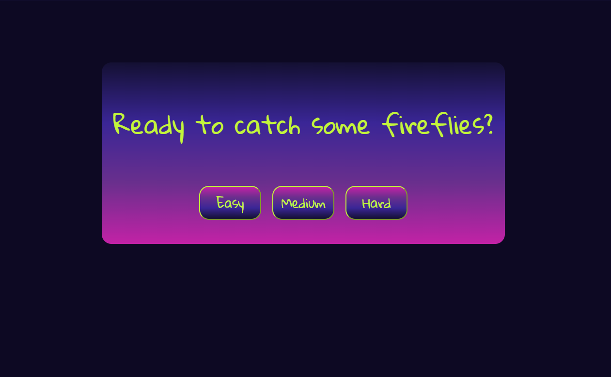
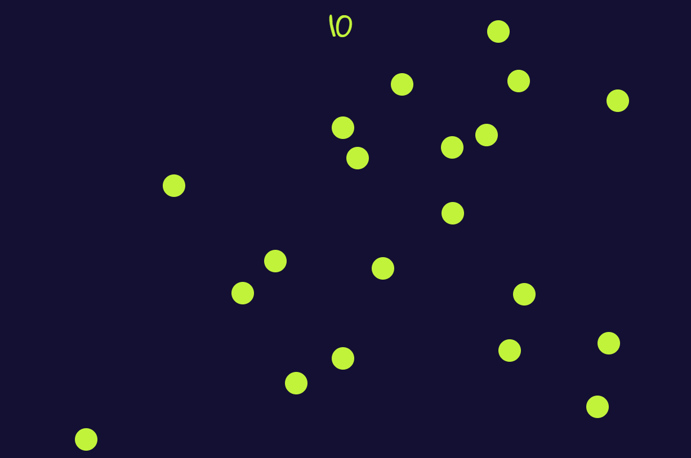

# Firefly Catcher Game

## Capstone project

### Alysson Campbell

## Start menu:

## Gameplay example:

## What is Firefly Catcher?

I was inspired to make a game where the player can listen to relaxing nightime sounds while collecting fireflies. This is mobile-freindly and simple to play. Easy mode generates 10 fireflies, medium 20 and hard 30. Once game begins, there is a looping sound of crickets.

## Code Style:

Prettier

## Built with:

- HTML
- CSS
- jQuery

## Want to contribute?

[Main Repository](https://github.com/AlyssonCampbell/project4)

[Issue Tracker](https://github.com/AlyssonCampbell/project4/issues)

## Credit:

[Sound effect credit: "Ambience, Night Wildlife, A.wav" by InspectorJ](www.jshaw.co.uk) of Freesound.org

## Copyright info:

&copy; Alysson Campbell, 2018
