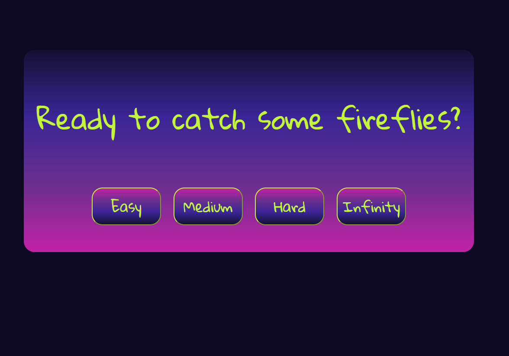

# Firefly Catcher Game

## Capstone project

### Alysson Campbell

## Start menu:

## Gameplay example:

## What is Firefly Catcher?

I was inspired to make a game where the player can listen to relaxing night time sounds while collecting fireflies. This is mobile-friendly and simple to play. Easy mode generates 10 fireflies, medium 20 and hard 30. Once game begins, there is a looping sound of crickets and a droplet sound when the fireflies are clicked.
In Infinity mode, a new firefly will appear each time one is clicked. When all moving fireflies are clicked, the resting ones will animate one by one, like fireflies taking flight. To end Infinity mode, the player can click the stop button and it will show how many were caught in the time played.

## Code Style:

Prettier

## Built with:

- HTML
- CSS
- jQuery

## Want to contribute?

[Main Repository](https://github.com/AlyssonCampbell/project4)

[Issue Tracker](https://github.com/AlyssonCampbell/project4/issues)

## Credit:

[Background Sound effect credit: "Ambience, Night Wildlife, A.wav" by InspectorJ](https://www.jshaw.co.uk) of Freesound.org

[Clicked Sound effect credit: "drip.wav" by Nightflame](https://freesound.org/people/Nightflame/) of Freesound.org

## Copyright info:

&copy; Alysson Campbell, 2018
